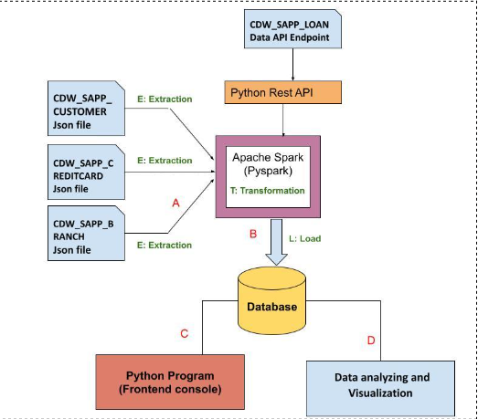
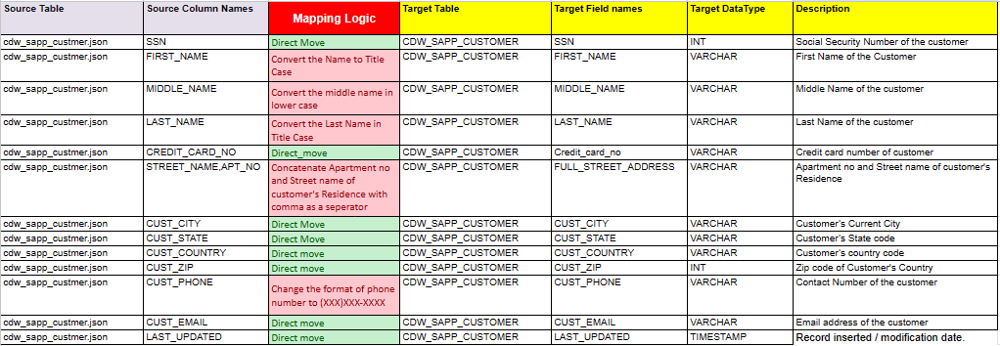
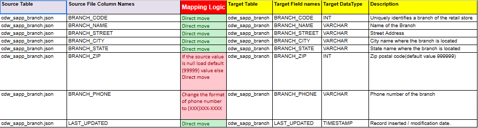
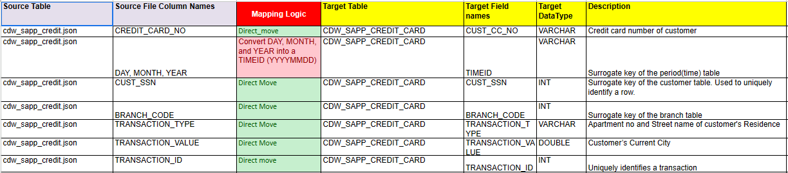
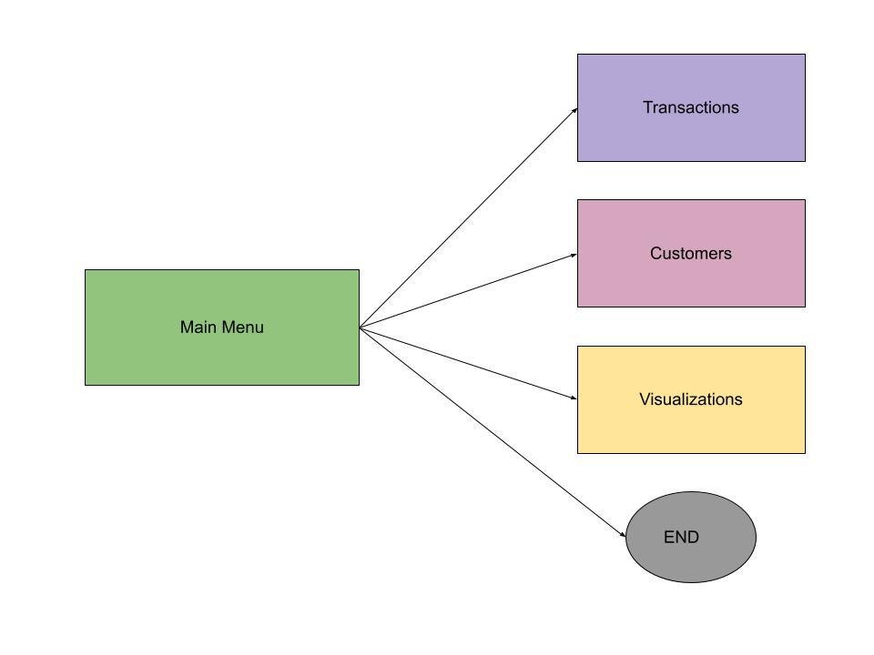
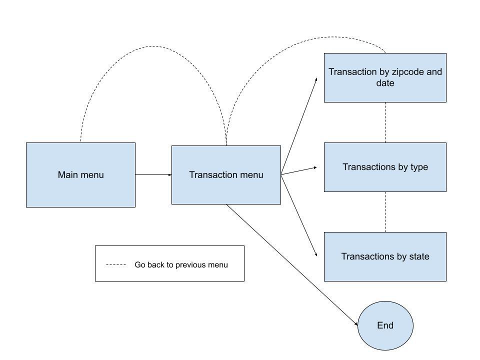
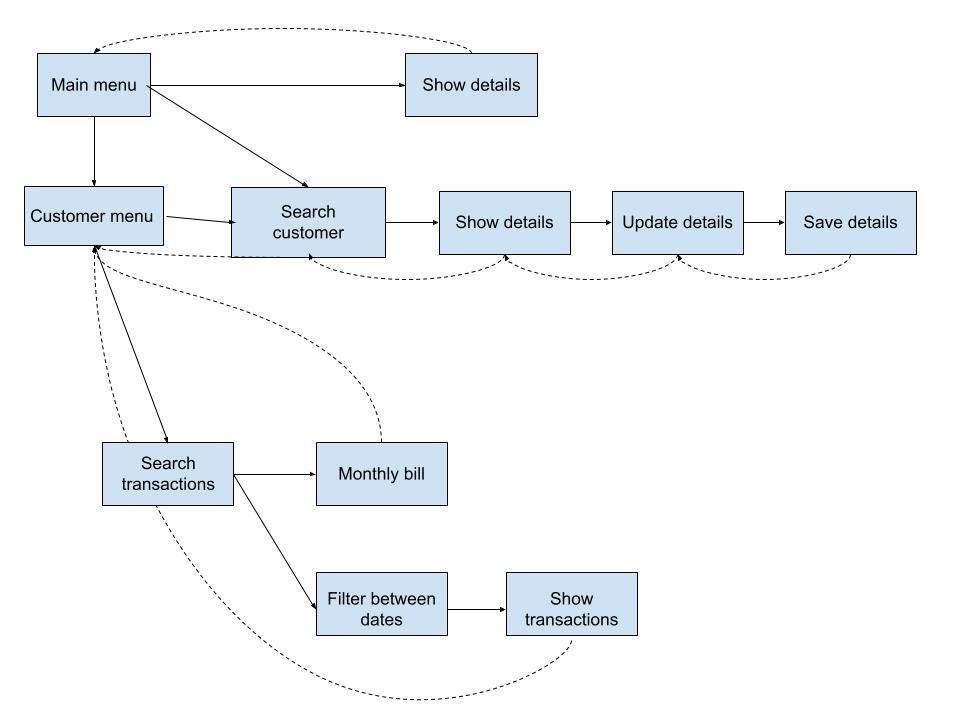

# Data Engineering Capstone Project
## BANK SYSTEM SIMULATION

### Description
This project emulates some of the processes that would take place in a bank. We need to manage an ETL (extraction, transformation, loading) process, a front-end to for the user to interact and input instructions to the system and a data analysis/visualization component to retrieve the data that we need.
fig. 1: Bank system schema</img>

At first, we have three JSON files that contain personal information of customers, information about the bank branches, information about transactions during 2018, respectively. The first step is extract this data from the files and store it in Spark dataframes, transform them into a required format and load them into a database resulting in one table per file. At the same time, we have a fourth source of data from a data API endpoint that we need to include in our database but without transformation. 

The transformations that were required for each table can be seen on the following images. However, some of them as varchar(n) are not supported by PySpark.

fig. 2: Required transformation for customers' table</img>

fig. 3: Required transformation for branches' table</img>

fig. 4: Required transformation for transactions' table</img>

Once the data is transformed into the final format, we use JDBC connection to write the data from Spark dataframe into the database. 

From our front-end console, we retrieve the data from the database through MySQL queries. We have queries to display data related to transactions in general such as number of transactions and total amount of a certain type of expense or from a specific ZIP code or state. We can also retrieve personal details about a specific customer, update their information or see the monthly bill and transactions during a period of time. Besides, we can generate graphics and results for data analysis.

The system works on the terminal. We use keys to choose options from menus and submenus, go back to a previous menu or exit the program. 

As we can observe in the following figures, some of the requirements shared common paths to achieve them such as displaying and updating customer's details. For both cases, we need to search for the customer. In every menu where we can choose an option, there are also options to go back to previous menu or end the program.

fig. 5: Structure of main menu</src>

fig. 6: Structure of transactions module</src>

fig. 7: Structure of customers module</src>

### Chalenges and Recommendations
<ul>
    <li>Add a secret file to the root folder of the project, which must include your user and password to access the database server.</li>
    <li>The data type of the TIMEID field for the transaction table (string) made it harder to manage because in several instances we had to slice it to and move around to evaluate conditions. We could not use MySQL functions to extract month, day or year. A timestamp type would have been more suitable.</li>
    <li>For future improvements, we could enable interaction with the user for the data analysis/visualization phase by asking the user to input a filter (i.e. top 5 instead top 3 of months with highest transaction value)</li>
    <li>Remove the CUST_SSN field from the transaction table and use the CREDIT_CARD_NO to link the customer with the transactions.</li>
    <li>The requirements ask for some of the data to be in varchar(n) format. However, this is not supported in PySpark so we cast it to string. </li>
    <li>In PySpark, if a function is not built-in and we need to define it, we also have to convert it using the UDF() function from PySpark.sql library. We should try to avoid this and search from its built-in library because it could impact performance.</li>
</ul>